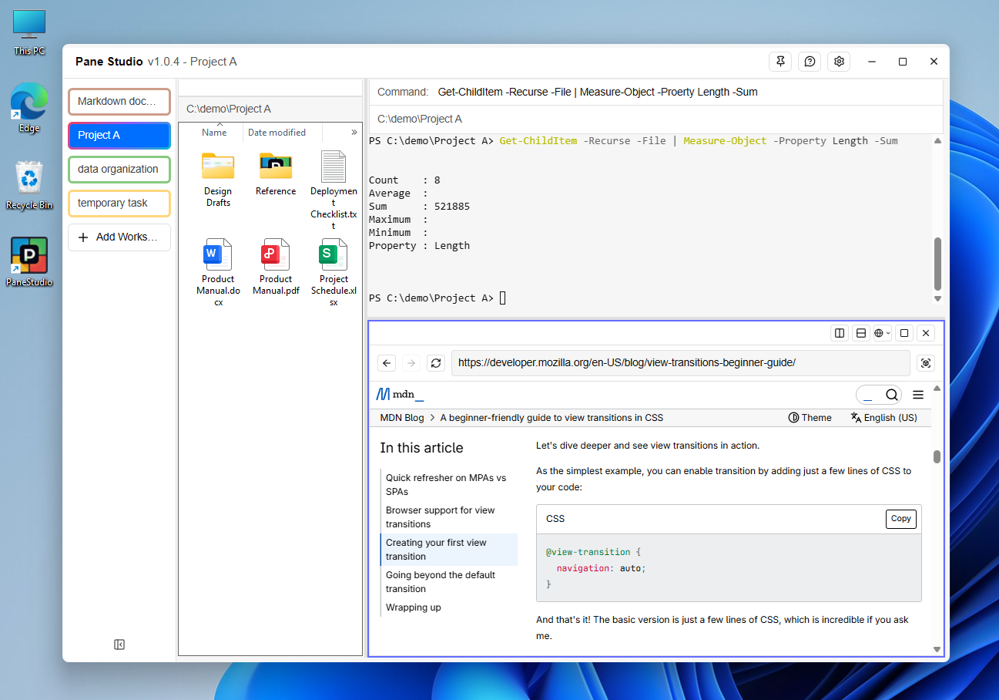
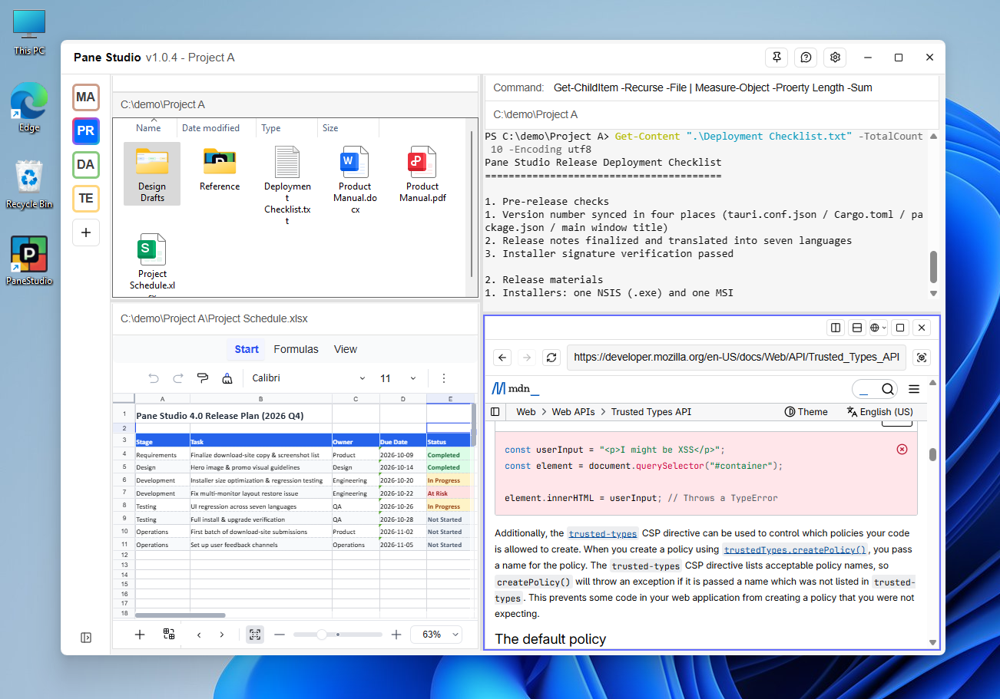
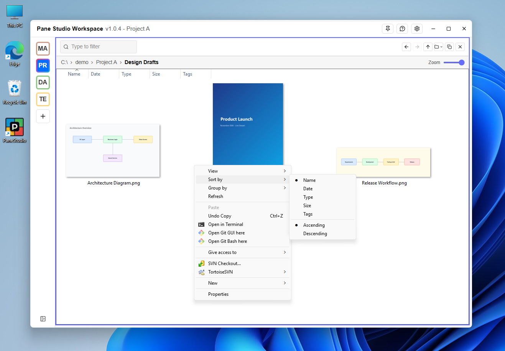
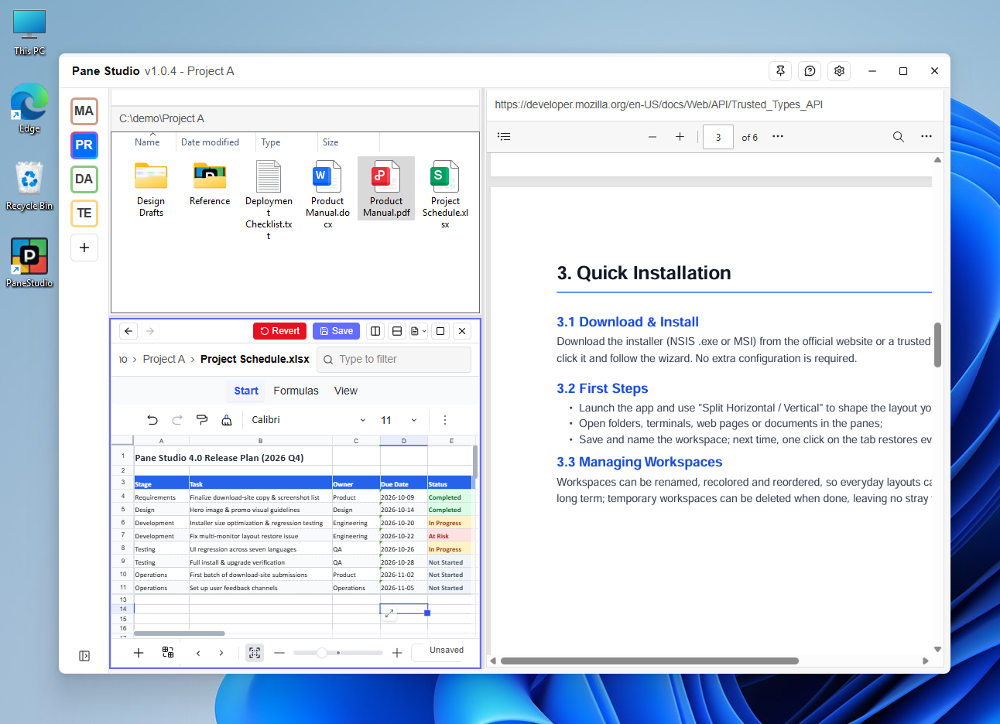
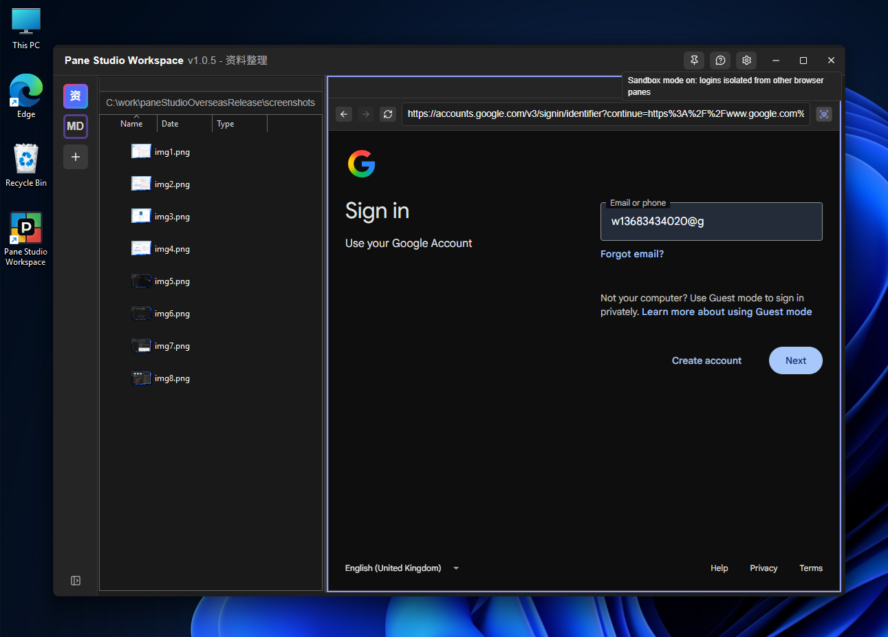
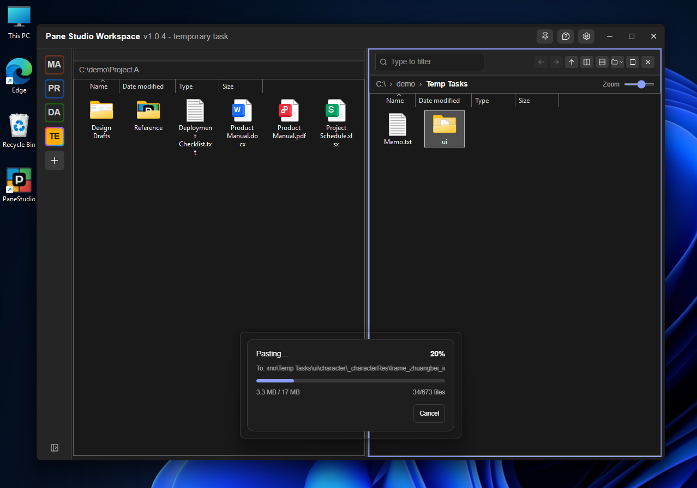
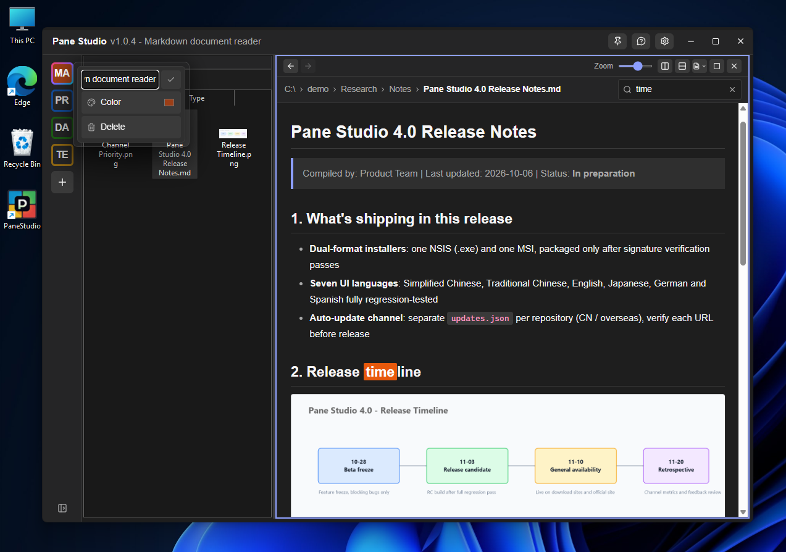

# Pane Studio — A Freely Splittable Desktop Workspace for Windows

Pack four kinds of panes — file manager, terminal, web browser, and document viewer — into a single, freely splittable window. Any pane can be split horizontally or vertically, maximized, and restored. A layout you arrange can be named and saved as a **workspace**; clicking its tab brings the whole group back, and it survives a reboot unchanged.

## Download

- **Windows 10 / 11 (64-bit)**, free, no ads, installer approx. 8.5 MB:
  [PaneStudio_1.0.4_overseas_x64-setup.exe](https://raw.githubusercontent.com/xlan8/paneStudioRelease/refs/heads/main/PaneStudioWorkspace_1.0.4_overseas_x64-setup.exe)
- The app has a built-in auto-updater: when a new version is released, you'll be prompted at startup and can upgrade with one click.
- UI languages: Simplified Chinese, Traditional Chinese, English, Japanese, German, Spanish, French (selected automatically based on the system language).
- Web panes are based on Microsoft Edge WebView2, which Windows 10/11 usually includes out of the box.

## Why You Need It

Windows File Explorer works well, but it can only do one thing at a time. To edit a spreadsheet while reading a document, looking something up in a browser, and running commands — you end up juggling four or five windows: hunting for them, minimizing them, covering each other up, switching in the taskbar.

When it comes to "tiling windows," Windows 11 does offer Snap Layouts and virtual desktops, but both manage a set of independent windows: snapping is only a temporary arrangement — the layout can't be saved or named, and **everything is lost after a reboot**, while the taskbar and Alt+Tab remain cluttered with a long list of window entries.

Pane Studio's approach is straightforward: **instead of jumping between a pile of windows, put them together in one.**

- All panes live in a single window — one taskbar icon and one Alt+Tab entry in total;
- Arrange a layout, give it a name, and save it as a workspace; next time, one click on its tab restores the whole group;
- Switching workspaces works like browser tabs: rather than swapping an entire desktop, you swap one arrangement for another inside the same window — flipping between two layouts takes two clicks;
- Files copied in one folder pane paste directly into another; the terminal, web pages, and documents sit side by side on the same screen. The next time you open a tab, the folders, URLs, and documents you had open come back with it.

## Five Pane Types

The main interface has two parts: a **workspace bar** on the left (each tab is an independent window layout) and an arrangement of **panes** on the right. Each pane can be:

| Pane type | Description |
| --- | --- |
| **Folder** | Uses the real Windows Explorer control — native system icons, thumbnails, sorting, and context menus, not an imitation list |
| **PowerShell** | An embedded terminal that runs commands right in the pane; can be set to run a fixed command automatically at startup |
| **Web** | An embedded browser (WebView2) with address bar, back/forward, and refresh; each pane can enable **sandbox mode** independently, keeping login state isolated from other panes so multiple accounts never mix |
| **Document Viewer** | Drag in a file to view PDF, Markdown, or Word; Excel workbooks (.xlsx) can be viewed, edited, and saved back to the original file |
| **Blank** | An empty pane with no type yet — click an icon to switch it to any of the above |

Any pane can be **split horizontally** or **split vertically**, and can be **maximized** to fill the whole workspace and then restored; split ratios are remembered.

## Feature Overview

- **Freely splittable layout** — any pane can be split horizontally or vertically; maximize and restore with a click; split ratios are saved automatically.
- **Truly native file view** — the folder pane embeds Windows' own Explorer control: icons, thumbnails, context menus, sorting, and zooming are all native system behavior; supports instant keyword filtering and multiple zoom levels.

- **Direct document preview and editing** — PDF, Markdown, and Word all support search and zoom as read-only previews; Excel workbooks (.xlsx) can be edited directly and saved back to the original file.

- **Embedded browser** — open web pages without leaving the workspace; each web pane can enable **sandbox mode** independently, keeping login state isolated from other panes so multiple accounts never mix.

- **Cross-pane copy & paste** — copy / cut / paste directly between panes; pasting runs in a separate progress window showing real-time progress that can be cancelled at any time, so long tasks never freeze the UI.

- **Multiple workspaces** — create as many workspaces as you like, each with its own layout; rename, color-tag, drag to reorder, and delete, so layouts can be reused long-term.
- **Readable Markdown out of the box** — headings, tables, code blocks, and images fully rendered.

- **Built-in terminal** — the PowerShell pane runs commands directly in a specified directory; supports running a fixed command automatically at startup.
- **AI automation support** — enable "Agent support" in Settings and the app reserves a local debug port, letting external AI tools (e.g. Playwright) take over web panes for automation; turn it off whenever you're done.
- **File change watching** — folder contents refresh automatically when modified externally, no need to press F5.
- **Dark & light themes** — switches automatically with your Windows system setting; **always on top** pins the window above everything with one click.

## Who It's For

- **Developers / Ops** — open a source directory on the left, run a terminal on the right, add a browser pane to look up errors when needed; set the layout once and reuse it forever.
- **Data analysis / Finance / Admin** — comparing multiple Excel files is a daily must: arrange two or three sheets as panes, view and edit them side by side, then save each back to its original file — no more switching between workbook windows.
- **Document reading / Light office work** — treat it as an instantly available lightweight Office: when a PDF, Word, or Excel file arrives and you want a quick look, just drag it into a pane — and Excel workbooks (.xlsx) can even be edited and saved.
- **Remote desktop users** — files in a remote clipboard can be pasted directly into a pane, no more manual uploading and downloading.
- **One-off tasks** — tidy up files, grab information from a web page, or process a spreadsheet; close the window when done and leave no pile of leftover windows behind.

## Things to Know

- **Requires Microsoft Edge WebView2 Runtime** — Windows 10/11 usually includes it; if a web pane says it can't initialize, install the runtime from Microsoft's website.
- **Excel editing involves trade-offs** — the built-in spreadsheet editor is deliberately lightweight, positioned as "quick viewing + routine data edits": changing values, adding records, and adjusting content are fully covered, and simple formulas calculate normally. It is not a full Office replacement: on save, advanced features in the original document such as images, charts, macros, and complex formulas may be lost. The app clearly warns you before the first save — always back up important files.
- **Mouse hooks** — to switch focus correctly between panes, the app installs low-level mouse/keyboard hooks; this is normal functionality. A few security tools may flag it as suspicious — simply add it to the whitelist.

## App Information

| Item | Details |
| --- | --- |
| Name | Pane Studio |
| Current version | 1.0.4 |
| Size | approx. 8.5 MB (installer) |
| Category | System Tools → File Management / Multi-pane Workspace |
| License | Free |
| Supported OS | Windows 10 / 11 (64-bit) |
| UI languages | Simplified Chinese, Traditional Chinese, English, Japanese, German, Spanish, French |
| Required component | Microsoft Edge WebView2 Runtime |
| Installer formats | NSIS (.exe), MSI |
